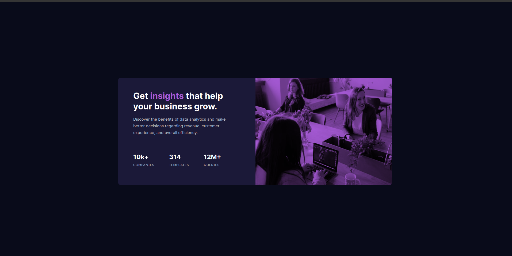

# Frontend Mentor - Stats preview card component solution

This is a solution to the [Stats preview card component challenge on Frontend Mentor](https://www.frontendmentor.io/challenges/stats-preview-card-component-8JqbgoU62). Frontend Mentor challenges help you improve your coding skills by building realistic projects. 

## Table of contents

- [Overview](#overview)
  - [The challenge](#the-challenge)
  - [Screenshot](#screenshot)
  - [Links](#links)
- [My process](#my-process)
  - [Built with](#built-with)
  - [What I learned](#what-i-learned)
  - [Continued development](#continued-development)
- [Author](#author)
## Overview

- Design the stats preview card component and the design should be reponsive for the following screen sizes.
- Mobile device - 375px
- Desktop device - 1440px

### The challenge

Users should be able to:

- View the optimal layout depending on their device's screen size

### Screenshot

### Links

- Solution URL: [Project URL](https://github.com/appu912/stats-preview-card-component-main)
- Live Site URL: [Live URL](https://appu912.github.io/stats-preview-card-component-main/)

### Built with

- Semantic HTML5 markup
- CSS custom properties
- Flexbox
- CSS Grid
- Mobile-first workflow

### What I learned

- In this project I learned how to use CSS Flexbox and grid together to achieve the required design.
- Moreover I also learned to use media queries for responsive web design. 

### Continued development

- Though I learned using media queries, but I am not good at making the design suitable for all device sizes.
- In the future, I will learning how make a design good for all screen sizes.

## Author

- Website - [Apoorv Mehra](https://appu912.github.io/cv/)
- Frontend Mentor - [@appu912](https://www.frontendmentor.io/profile/appu912)
